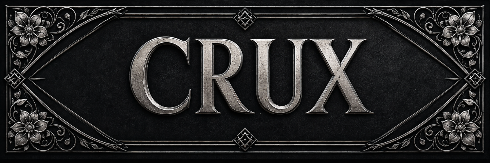
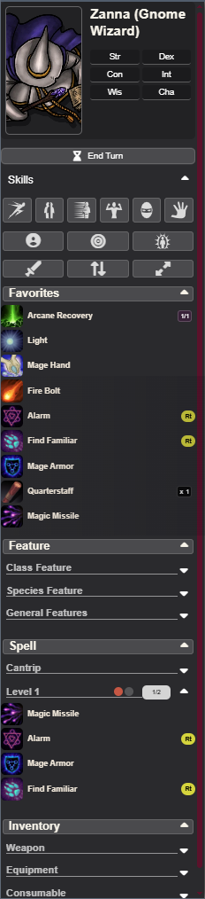

<p align="center">
  
</p>

# CRUX
*(Combat Ready User Xperience)*

> CRUX is a continuation and enhancement of the "Action Pack" module originally created by Tero Parvinen.
> Original module: https://github.com/teroparvinen/foundry-action-pack



<p>
  
  
  
  
  
</p>

**CRUX** adds a sliding action tray to Foundry VTT for dnd5e, giving players quick access to actions, spells, abilities, token controls, and common combat tools without opening the character sheet.

Designed to complement Foundry's left-side interface, Crux keeps the character's most-used options close at hand during play.

- **Foundry VTT:** minimum v13, verified v14
- **System:** dnd5e
- **Optional support:** Tidy 5e Sheet sections
- **Automation friendly:** dnd5e/MidiQOL-style item and activity activation flow

**At a Glance**

- Sliding left-side tray for fast actor actions
- Activatable items, spells, features, and basic dnd5e actions
- Favorites, equipped items, spell groups, inventory, and passive sections
- Ability and skill rolls without opening the character sheet
- Spell slot, use, quantity, and action-type indicators
- Token tools for targeting, effects, combat, elevation, and turns
- Font, scaling, section, skill list, and tray display customization
- Optional support for Tidy 5e Sheet sections and Taskbar compatibility

**Install Manifest**

```text
https://github.com/Relic-Repo/crux/releases/latest/download/module.json
```

<br clear="left">

## Features

### Action Tray
- Sliding left-side tray with manual, automatic, and always-show modes
- Quick access to activatable items, spells, features, abilities, and basic actions
- Favorites, Equipped, Features, Spells, Inventory, and Passive sections
- Expand/collapse controls for sections and groups

### dnd5e Actions and Rolls
- Basic action buttons for Dash, Disengage, Dodge, Grapple, Hide, and Shove
- Actor-owned action items are used when present
- Fallback chat cards are created when no matching action item exists
- Ability and skill rolls
- dnd5e modifier key behavior for skip-dialog and advantage/disadvantage item use

### Resources and Indicators
- Spell slot dots and optional spell slot numbers
- Quantity and uses indicators
- Bonus action, reaction, concentration, ritual, unprepared, and legendary indicators
- Apothecary and pact spell slot support

### Token Tools
- Token configuration access
- Target mode toggle
- Drag-and-drop item targeting
- Status effects window
- Add to combat
- Elevation control
- End turn and roll initiative prompts

### Customization
- Tray size from 200-300px
- Small, medium, and large icon sizes
- Font family and custom font support
- Global, content, and character-name text size controls
- Health overlay options
- Empty tray icon selection
- Section visibility and default expansion settings
- Skill list placement
- Tidy 5e Sheet section support
- Taskbar compatibility

## Installation

1. In Foundry VTT's setup screen, go to the "Add-on Modules" tab.
2. Click "Install Module".
3. Search for "CRUX" or paste this manifest URL:

```text
https://github.com/Relic-Repo/crux/releases/latest/download/module.json
```

## Compatibility

- **Foundry VTT:** minimum v13, verified v14
- **System:** dnd5e
- **Optional modules:** Tidy 5e Sheets, MidiQOL-style item workflows, Foundry Taskbar compatibility

CRUX is designed for the dnd5e system and follows the system item/activity use flow where possible so other automation modules can recognize Crux-triggered item use.

## Support

CRUX is free and will remain free. If it helps at your table and you want to support development, you can buy me a coffee on Ko-fi.

<a href="https://ko-fi.com/B0B5HLJZG">
  
</a>
